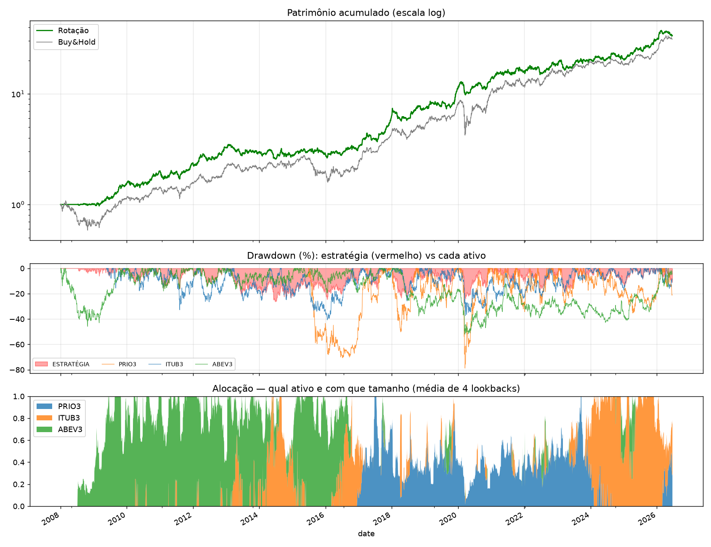

# Quant Momentum — Rotação Dinâmica

Sistema de trading sistemático de **momentum cross-sectional + volatility targeting + média de parâmetros**, aplicado a três ações brasileiras (ITUB3, PRIO3, ABEV3) desde 2008.

## A ideia em uma frase

Todo dia, o sistema ranqueia os três ativos pelo retorno passado, aloca o capital no mais forte e dimensiona a posição pela volatilidade — usando quatro janelas de momentum ao mesmo tempo para não depender de um único prazo. Troca de ativo quando outro assume a liderança.

## Resultados (desde 2008, líquido de custos)

| Estratégia | Sharpe | Sortino | Max Drawdown | Retorno |
|---|---|---|---|---|
| **Rotação (este sistema)** | **1,09** | **1,58** | **−26%** | **+3.257%** |
| Buy & Hold (1/3 cada) | 0,83 | 1,15 | −52% | +3.017% |

Walk-forward (treino → prova → desde 2021): **0,95 → 1,21 → 0,96**.

A rotação supera o buy & hold em retorno **e** risco — mesma ordem de retorno, metade do drawdown.



## Como rodar

```bash
pip install -r requirements.txt
python3 rotacao_graf.py      # estratégia + gráfico (3 painéis)
python3 rotacao.py           # só as métricas (núcleo, 16 linhas)
```
Requer a pasta `dados/` com os CSVs (`date, open, high, low, close, adjustedClose, volume`).

## Estrutura

| Arquivo | Conteúdo |
|---|---|
| `rotacao.py` | Núcleo da estratégia (16 linhas, vetorizado) |
| `rotacao_graf.py` | Estratégia + gráfico (patrimônio / drawdown / alocação) |
| `ROTEIRO_APRESENTACAO.md` | Roteiro de apresentação (a lógica, parte por parte) |
| `CONCEITOS.md` | Glossário dos conceitos usados |
| `DEFESA.md` | Perguntas críticas + respostas (e críticas dos estudiosos) |
| `dados/` | Preços ajustados dos 3 ativos |

## Como funciona (sem jargão)

1. Lê o preço ajustado (já com dividendos) dos 3 papéis desde 2008.
2. Todo dia, mede quem subiu mais nos últimos meses — usando 4 janelas (126/189/252/315 dias).
3. Aloca no mais forte; o tamanho cai quando o ativo está volátil (controle de risco). Nunca usa alavancagem.
4. Compra **no dia seguinte** ao sinal (sem look-ahead) e desconta a taxa de cada operação.
5. Compara com comprar e segurar.

## Limitações (honestas)

- **Apenas 3 ativos** → amostra estatística pequena (baixa *breadth*).
- **O passado não garante o futuro** — o backtest é um ensaio, não uma promessa.
- **Viés de seleção** — os 3 ativos foram escolhidos sabendo que sobreviveram.
- **Long-only, sem alavancagem** — não protege num crash geral do mercado.
- **Momentum decai** com o tempo (efeito de *crowding* / maturação).

Stack: Python · pandas · numpy · matplotlib.
