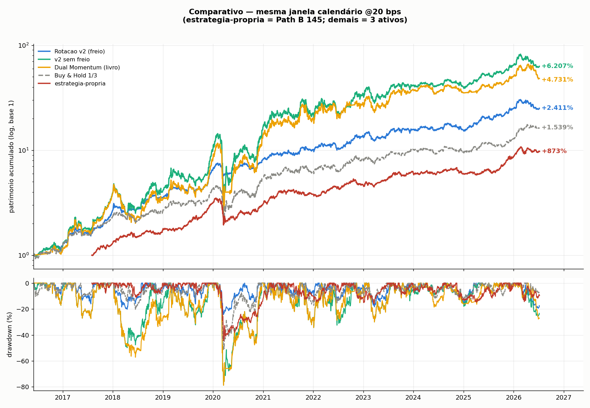
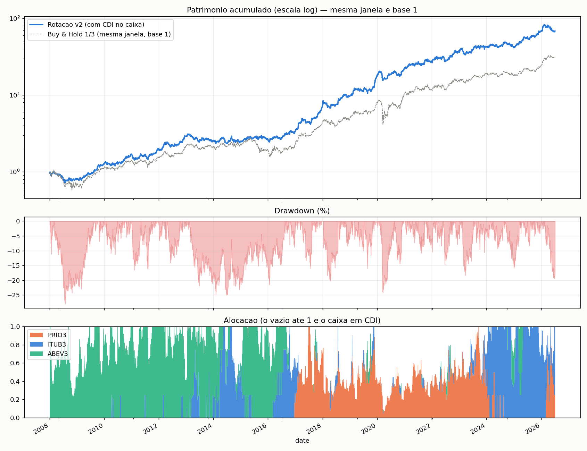
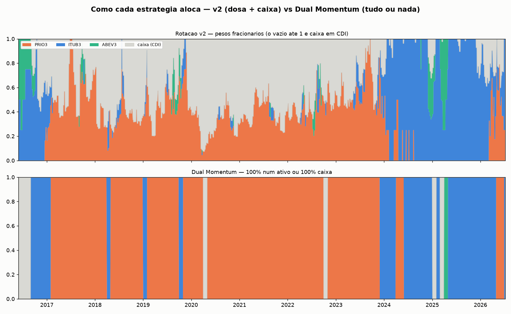
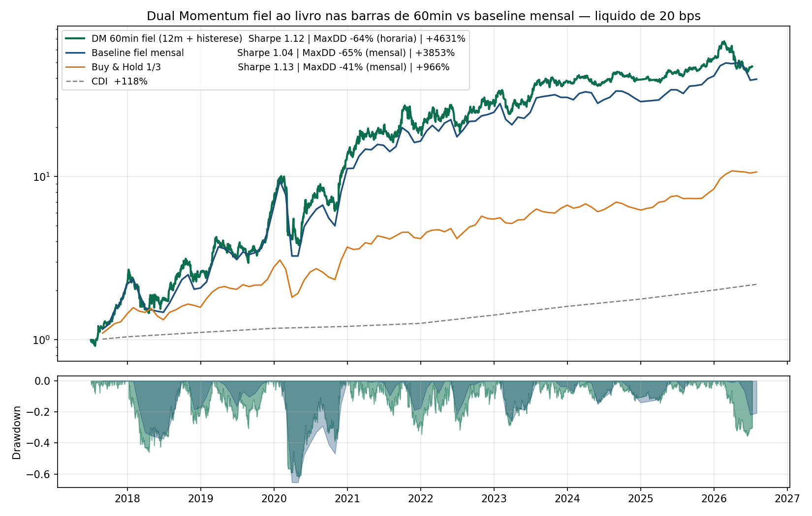

# Quant Research

Rotacao Momentum v2 — estrategia sistematica de momentum cross-sectional com **volatility targeting** e rebalance semanal, aplicada a ITUB3, PRIO3 e ABEV3. A cada dia o sistema mede o momentum dos tres ativos em quatro janelas (6, 9, 12 e 15 meses), aloca no mais forte, **dimensiona a posicao pela volatilidade do portfolio** (mira 20% ao ano) e congela os pesos por uma semana. O capital nao investido rende 100% do CDI. Long-only, sem alavancagem, liquido de **20 bps por ordem**, sem look-ahead (`shift(1)`).

A logica tem tres camadas independentes: **direcao** (em quem — a media dos lideres das quatro janelas), **tamanho** (quanto — o vol target, uma vez, no nivel do portfolio) e **ritmo** (quando — rebalance semanal).

## Resultados — duas janelas, mesma regua (diaria, 20 bps)

**Lab / `rotacao.py` (amostra desde 2008, warm-up honesto — E37):** Sharpe **1,18** | MaxDD **−28%** | retorno +6.740%.  
(Antes do E37 o código cortava a história em 2008 e reportava 1,30/−25% com 2008 inteiro em CDI por artefato. PRIO só entra em meados de 2015; ITUB em 2009. CDI do caixa: série diária BCB.)

**Comparativo (janela calendário ~2016-06+, `comparativo.py`, ativas @20 bps):**

| Estrategia | Universo | Sharpe | Vol | Max Drawdown | Retorno |
|---|---|---|---|---|---|
| **Rotacao v2 (freio)** | 3 ativos | **1,56** | 22% | **-24%** | +2.411% |
| v2 sem freio | 3 ativos | 1,09 | 50% | -79% | +6.207% |
| Dual Momentum mensal (livro, no comparativo) | 3 ativos | 1,03 | 50% | -79% | +4.731% |
| Buy & Hold 1/3 | 3 ativos | 1,17 | 27% | -52% | +1.539% |
| **estratégia-própria** | Path B 145 | **1,31** | 22% | **-45%** | +873% |



**estratégia-própria** (nome oficial): breadth Path B — +100% Top20 / −30% Bottom10 / +30% CDI; sinal = **média dos percentis** de momentum em **3/6/9/12 meses** (lab E48; substitui o single-365d E45). Série em `dados/estrategia_propria_diario.csv`. **Universo distinto** dos 3 ativos: o gráfico alinha o calendário; **não** é apples-to-apples de painel. Pseudocódigo: [docs/pseudocodigo/estrategia_propria.md](docs/pseudocodigo/estrategia_propria.md).

**Leitura (linha 3 ativos):** o vol target ("o freio") e o que separa a v2 do resto. Sem ele, a rotacao converge para o Dual Momentum classico (mesma vol de 50%, mesmo drawdown de -79%) — ou seja, o diferencial da v2 nao esta no sinal de direcao, e sim no **controle de risco**. **Nao confundir** o 1,56 (janela 2016+) com o 1,18 (amostra 2008+ apos E37).



## Sinais das duas estrategias

As alocacoes da Rotacao v2 (pesos fracionarios + caixa) e do Dual Momentum baseline mensal (tudo-ou-nada) no mesmo eixo do tempo — `python3 src/sinais_comparados.py` gera o grafico e exporta CSVs em `out/`:



## Dual Momentum (apresentado)

O `dual_momentum.py` e **o** Dual Momentum deste repo: nucleo do livro INTACTO (momentum de **12 meses por calendario** + barreira do CDI dos mesmos 12 meses), avaliado a cada **barra de 60min**, com UMA concessao — **histerese de 5%** na troca de lider. Nao ha outro "Dual Momentum" apresentado; o arquivo mensal e so baseline de comparacao.

| Versao | Sharpe | MaxDD (regua) | Retorno | Custo/ano | Sinais / execucao |
|---|---|---|---|---|---|
| **Dual Momentum** (`dual_momentum.py`, barras 60min) | **1,13** | -64% (horaria) | **+4.931%** | **3,6%** | **147 rebalances em 9 anos; 167 ordens de compra/venda** |
| Dual Momentum mensal (`dual_momentum_mensal.py`, baseline) | 1,04 | -65% (mensal; -79% diaria) | +3.858% | 6,0% total (30 ordens) | 18 **meses** com mudanca de peso em 9 anos; 30 ordens |

**Nao confunda as contagens.** No Dual Momentum de 60min, um **rebalance** e qualquer troca de alvo: caixa→ativo, ativo→caixa ou ativo→ativo. Foram 147 rebalances (64 entradas do caixa, 63 saidas para caixa e 20 trocas entre ativos). Uma mudanca de um ativo para outro exige duas **ordens**: vender o ativo anterior e comprar o novo. Por isso os 147 rebalances exigiram 167 ordens de compra/venda, a 20 bps por ordem.

Os **18** do baseline mensal nao sao “18 sinais” do Dual Momentum de 60min: sao 18 meses em que o peso mensal mudou. Essa trilha mensal exigiu 30 ordens equivalentes. Barras de 60min sao o relogio de decisao; o sinal continua usando momentum e barreira CDI de 12 meses por calendario.



**Leitura honesta:** descontada a selecao de variantes do laboratorio (~0,12 de barreira), o Sharpe EMPATA com o baseline mensal — a escolha pelas barras de 60min se sustenta em fidelidade + uso integral do timestamp real + custo mecanicamente baixo, nao num Sharpe "maior".

## Pseudocodigos

Narrativa linha a linha (em portugues) dos scripts apresentados:

- [Rotacao v2](docs/pseudocodigo/rotacao_v2.md) · [Dual Momentum](docs/pseudocodigo/dual_momentum.md) · [estratégia-própria](docs/pseudocodigo/estrategia_propria.md)
- Indice: [docs/pseudocodigo/](docs/pseudocodigo/)

## Como rodar

```bash
pip install -r requirements.txt
python3 rotacao.py                 # v2 (atalho → src/)
python3 dual_momentum.py           # Dual Momentum (apresentado, barras 60min)
python3 dual_momentum_mensal.py    # Dual Momentum mensal (baseline)
python3 comparativo.py             # 4 estrategias + figura
python3 rotacao_graf.py            # v2 + grafico 3 paineis
# ou direto:
python3 src/rotacao.py
python3 src/sinais_comparados.py
```

Requer a pasta `dados/` (CSVs dos 3 ativos + `base_plana.csv` para o Dual Momentum).

## Estrutura

```
├── README.md
├── requirements.txt
├── rotacao.py / dual_momentum.py …   # atalhos na raiz (chamam src/)
├── src/                              # codigo canônico
│   ├── rotacao.py                    # v2
│   ├── dual_momentum.py              # Dual Momentum apresentado (barras 60min)
│   ├── dual_momentum_mensal.py       # Dual Momentum mensal (baseline)
│   ├── comparativo.py / *_graf.py / sinais*.py
│   └── _paths.py                     # dados/, figures/, out/
├── figures/                          # PNGs do README
├── docs/
│   └── pseudocodigo/                 # narrativa linha a linha (.md + .docx)
├── dados/                            # precos
└── out/                              # CSVs gerados (gitignored)
```

| Pasta / arquivo | Conteudo |
|---|---|
| `src/rotacao.py` | Estrategia v2 |
| `src/dual_momentum.py` | Dual Momentum apresentado (barras 60min) |
| `src/dual_momentum_mensal.py` | Dual Momentum mensal (baseline) |
| `figures/` | Graficos do README |
| `docs/pseudocodigo/` | Pseudocodigos linha a linha (md + docx) |
| `dados/` | Precos ajustados |

Stack: Python, pandas, numpy, matplotlib.
